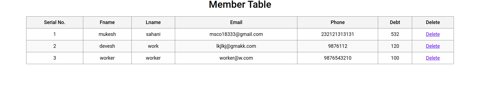

# Setup
For starting up the application, first install all node node modules required using command
```sh
npm install 
```
For Frontend start the reactjs server using command
```sh
npm start
```
For Backend start the express server using command
```sh
node app.js
```
now frontend and backend both has been started you access the service on any browser at url http://localhost:3000

# Here are Screen preview 

### Home Screen


### Books Operation Screen


### Add a New Book 


### Books List Screen


### Book Details


### Book Delete Screen


### Member Operation Screen


### Add a New Member Screen


### Member List screen


### Member Details


### Delete Member Screen


### Book Issue Feature 


### Return Book Feature


### Member Clear Debt Feature


